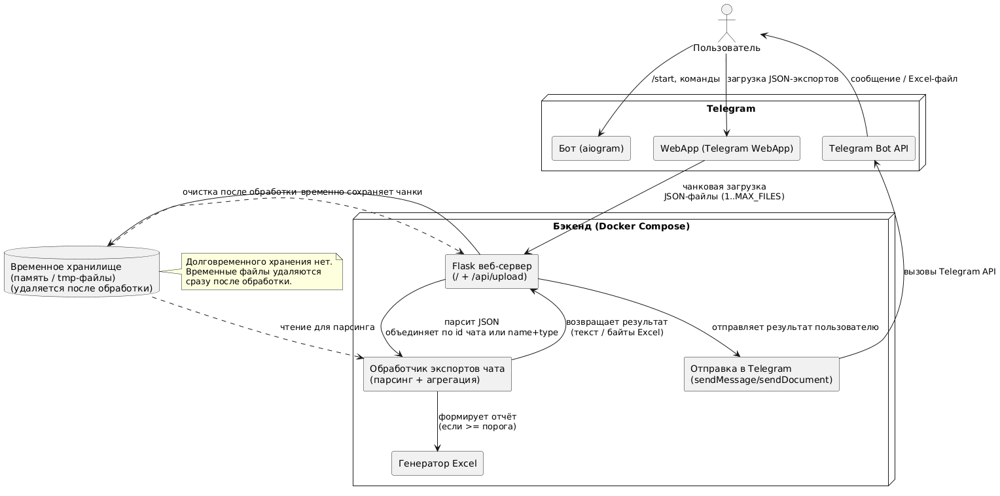

# Telegram Bot для извлечения участников чата

Бот принимает экспорт истории Telegram-чата (JSON из Telegram Desktop), извлекает уникальных участников (кто писал сообщения) и пользователей, которых упоминали в тексте (@username), и возвращает результат в виде списка или Excel-файла.

Инструмент полезен, когда Telegram не даёт увидеть полный список участников (например, нет прав администратора), но есть экспорт истории и нужно понять состав аудитории.

## Общая информация

### Возможности:
- Загрузка JSON-экспортов истории чатов через WebApp (chunked upload для больших файлов)
- Автоматическое объединение файлов одного чата (по id или name+type)
- Извлечение участников из `from_id` в сообщениях
- Извлечение упоминаний @username из текста сообщений
- Формирование Excel-отчетов (>= 50 участников) или текстовых списков (< 50 участников)
- Объединение результатов нескольких файлов в один отчет (опционально)
- Отправка результатов напрямую в Telegram
- Обработка без сохранения данных на сервере (файлы удаляются сразу после обработки)

### Ограничения и особенности реализации:

- Формат файлов - только JSON (экспорт из Telegram Desktop)
- Количество файлов - максимум 10 за раз
- Размер файла - до 2 ГБ каждый (лимит WebApp, не Telegram API)
- Ожидаемая кодировка в загружаемых файлах - UTF-8
- Username можно получить только из упоминаний в тексте (@username) и иногда из поля автора, если оно присутствует в экспортируемых данных.
- Имя берётся из атрибута from (если есть).
- Bio/About, дата регистрации, наличие канала - недоступны из JSON-экспорта и не могут быть восстановлены корректно без дополнительных источников.

### Приватность и хранение данных:
- Экспорт-файлы используются только для обработки запроса.
- После завершения обработки файлы удаляются.
- Результат отправляется пользователю в Telegram, без долговременного хранения на сервере.

### Структура проекта

```
sf3-hackaton/
├── bot/                    # Telegram бот (aiogram 3.x)
│   ├── Dockerfile
│   ├── requirements.txt
│   ├── main.py
│   └── src/
│       ├── bot.py          # Класс TelegramBot
│       ├── handlers.py     # Обработчики команд
│       └── utils.py        # Утилиты и конфигурация
├── web/                    # Flask веб-сервер и WebApp
│   ├── Dockerfile
│   ├── requirements.txt
│   ├── app.py              # Flask приложение
│   ├── config.py           # Конфигурация
│   ├── processors.py       # Парсер чатов
│   ├── excel_generator.py  # Генератор Excel
│   ├── telegram_sender.py  # Отправка в Telegram
│   └── templates/
│       └── index.html      # WebApp интерфейс
├── docker-compose.yml      # Docker Compose конфигурация
├── tunnel_setup.sh         # Скрипт настройки Tuna туннеля
├── .env                    # Переменные окружения
├── README.md               # Этот файл
├── USER_GUIDE.md           # Руководство пользователя
├── SETUP_WEBAPP.md         # Инструкция по настройке WebApp
└── TODO.md                 # Планы на будущее
```

---

## Запуск

### Требования

- Docker и Docker Compose
- Токен бота от @BotFather
- Python 3.11+ (для локальной разработки)

### Получение токенов

#### 1. Токен Telegram бота (BOT_TOKEN)

1. Откройте Telegram и найдите бота [@BotFather](https://t.me/BotFather)
2. Отправьте команду `/newbot` или `/start`
3. Следуйте инструкциям:
   - Укажите имя бота (например: "Мой бот для анализа чатов")
   - Укажите username бота (должен заканчиваться на `bot`, например: `my_chat_analyzer_bot`)
4. BotFather выдаст вам токен вида: `123456789:ABCdefGHIjklMNOpqrsTUVwxyz`
5. **Сохраните этот токен** — он понадобится для настройки

**Важно:** Не делитесь токеном с другими! Это ключ доступа к вашему боту.

#### 2. Токен Tuna (TUNA_TOKEN) — опционально

Токен Tuna нужен только если вы используете туннель Tuna для WebApp.

1. Откройте сайт [tuna.am](https://tuna.am)
2. Зарегистрируйтесь или войдите в аккаунт
3. Перейдите в раздел получения токена (обычно в настройках профиля или на главной странице)
4. Скопируйте токен
5. **Сохраните этот токен** — он понадобится для настройки туннеля

**Альтернатива:** Если у вас есть свой домен с HTTPS, токен Tuna не нужен — просто укажите `BACKEND_URL=https://your-domain.com`

### Быстрый старт

1. Клонируйте репозиторий:
```bash
git clone <repository-url>
cd sf3-hackaton
```

2. Создайте файл `.env`:
```bash
cp .env.example .env
# Отредактируйте .env и укажите BOT_TOKEN (обязательно) и TUNA_TOKEN (опционально)
```

3. **Настройте публичный туннель (для WebApp):**

   Для работы WebApp нужен публичный HTTPS URL. **Основной вариант - Tuna:**
   ```bash
   # Токен можно указать в .env (TUNA_TOKEN) или как аргумент
   ./tunnel_setup.sh <TUNA_TOKEN>
   # Или если токен уже в .env:
   ./tunnel_setup.sh
   ```
   Скрипт:
   - Запускает web сервер
   - Поднимает туннель Tuna в Docker контейнере
   - Автоматически обновляет `BACKEND_URL` в `.env`
   - Запускает docker-compose для бота
   
   **Важно:** Добавьте `TUNA_TOKEN=your_token` в файл `.env` перед запуском скрипта.

4. Проверьте статус:
```bash
docker-compose ps
```

5. Просмотрите логи:
```bash
# Все логи
docker-compose logs -f

# Только бот
docker-compose logs -f bot

# Только веб-сервер
docker-compose logs -f web

# Туннель Tuna (если запускали через tunnel_setup.sh — логи в /tmp/tuna.log)
```

#### ⚠️ Важно о туннелях (`tunnel_setup.sh <token>`)
- URL может меняться при перезапуске туннеля — перезапускайте скрипт
- При первом открытии WebApp появится страница Tuna с кнопкой «Посетить» — нажмите её
- Для продакшена лучше использовать свой домен + HTTPS (Let's Encrypt)

---

## Технические детали

### Архитектура



### Группировка файлов

Файлы автоматически группируются по заголовку чата:
- Приоритет: `id` (если есть), иначе `name` + `type`
- Это позволяет группировать файлы одного чата, даже если `name` отличается или отсутствует
- Если несколько файлов имеют одинаковый `id` или `name`+`type`, они объединяются в один результат.

### Формат результата

- **< 50 участников:** текстовый список в чате
- **>= 50 участников:** Excel файл с двумя листами:
  - Участники
  - Упоминания

### Доступные данные

Из экспорта Telegram можно извлечь:
- ✅ `from_id` - ID участника
- ✅ `from` - имя участника
- ✅ `@username` - только из упоминаний в тексте
- ❌ Username участника (недоступен в экспорте)
- ❌ Описание профиля (недоступно)
- ❌ Дата регистрации (недоступна)
- ❌ Наличие канала в профиле (недоступно)

---

### Документация

<details>
<summary><b>Реализованные функции</b></summary>

1. Загрузка JSON-экспортов через WebApp (в т.ч. больших файлов).
2. Chunked upload: разбиение на чанки и отправка по частям.
3. Сборка файла из чанков (complete-upload).
4. Ретраи при ошибках/таймаутах для чанков (с backoff).
5. Отображение прогресса загрузки (общий и по файлам).
6. Ограничение размера файла (до 2 ГБ).
7. Ограничение количества файлов за загрузку (до 10).
8. Обработка нескольких файлов за один заход.
9. Группировка файлов одного чата (по id или name+type).
10. Выбор/нормализация имени чата внутри группы (первое непустое).
11. Опция объединить результаты всех файлов в один отчёт.
12. Валидация структуры экспорта (наличие/тип `messages` и базовые проверки).
13. Обработка битых/неполных JSON с понятной ошибкой.
14. Обработка различных кодировок (определение + fallback чтения).
15. Извлечение участников из `from_id`/`from` (обычные сообщения).
16. Извлечение участников из пересланных сообщений (`forwarded_from_id`/`forwarded_from`).
17. Игнорирование удалённых аккаунтов (по паттерну `deleted`).
18. Игнорирование каналов при извлечении участников из пересланных (по паттерну `channel`).
19. Извлечение упоминаний `@username` из текста сообщений.
20. Валидация `@username` (отсев невалидных).
21. Удаление дублей участников и упоминаний.
22. Правило выдачи результата по порогу (текст < 50 / Excel ≥ 50).
23. Текстовый вывод (Markdown + code blocks) для малых чатов.
24. Генерация Excel (.xlsx) для больших чатов (листы «Участники»/«Упоминания»).
25. Форматирование Excel (заголовки, автоширина колонок).
26. Генерация безопасных имён файлов результата (sanitization).
27. Именование результатов с датой/временем (отдельные и combined).
28. Отправка результата пользователю в Telegram (сообщение или документ).
29. Подпись к результату (caption) со статистикой.
30. Отправка inline-кнопок после обработки (повторная загрузка/помощь).
31. Команды бота `/start` и `/help` (инструкции + кнопка WebApp).
32. Прямая загрузка файла в чат с ботом (альтернатива WebApp, лимит Bot API).

</details>

<details>
<summary><b>Инструкция для пользователей</b></summary>

### Как использовать бота для извлечения участников чата

#### Шаг 1: Экспорт истории чата из Telegram

1. Откройте **Telegram Desktop** на компьютере
2. Откройте нужный чат
3. Нажмите на три точки (⋮) в правом верхнем углу
4. Выберите **"Экспорт истории чата"**
5. В настройках экспорта:
   - **Формат:** выберите **JSON** (обязательно!)
   - Снимите галочки с "Фотографии", "Видео" и других медиафайлов (чтобы уменьшить размер файла)
6. Нажмите **"Экспорт"**
7. Дождитесь завершения экспорта
8. Сохраните полученный файл `result.json` (или несколько файлов, если история большая)

#### Шаг 2: Загрузка файлов в бота

Есть два способа загрузки файлов:

##### Способ 1: Через WebApp (рекомендуется)

1. Откройте бота в Telegram
2. Нажмите команду `/start` или кнопку **"🌐 Открыть WebApp"**
3. При первом открытии появится страница сервиса Tuna с предупреждением:
   - На странице будет текст: "Вы собираетесь посетить [домен].ru.tuna.am"
   - И предупреждение о безопасности
   - **Нажмите кнопку «Посетить»** для продолжения
   - Это нормально — так работает туннель Tuna (безопасно)
4. В открывшемся окне:
   - Нажмите на область загрузки или перетащите файлы
   - Выберите JSON файлы экспорта (максимум 10 файлов)
   - Проверьте список выбранных файлов
   - При загрузке нескольких файлов появится опция "Объединить результаты в один файл"
5. Нажмите **"🚀 Загрузить и обработать"**
6. Дождитесь обработки (может занять некоторое время для больших файлов)

**Преимущества:** Поддержка файлов до 2 ГБ, можно загружать несколько файлов одновременно

##### Способ 2: Прямая загрузка в чат (альтернатива)

1. Откройте бота в Telegram
2. Отправьте команду `/start`
3. Отправьте JSON файл напрямую в чат с ботом
4. Бот автоматически обработает файл

**Ограничения:** Максимальный размер файла 20 МБ (ограничение Telegram API), по одному файлу за раз

**Рекомендация:** Используйте WebApp для файлов больше 20 МБ или при необходимости загрузить несколько файлов

#### Шаг 3: Получение результата

Результат зависит от количества участников:

##### Если участников меньше 50:
- Бот отправит текстовый список прямо в чат
- Список содержит:
  - Участников чата (кто писал сообщения)
  - Упоминания (@username из текста сообщений)
- Списки оформлены в code блоки для удобного копирования

##### Если участников 50 и больше:
- Бот отправит Excel файл (.xlsx)
- Файл содержит два листа:
  - **Участники** - список участников чата (Имя-фамилия, ИД)
  - **Упоминания** - упомянутые пользователи (@username)
</details>

<details>
<summary><b>Настройка WebApp</b></summary>
Telegram Web Apps требуют HTTPS для безопасности. Это обязательное требование, которое нельзя обойти. Для работы WebApp используется туннель Tuna - бесплатный сервис для создания публичного HTTPS URL.

### Получение токена Tuna

1. Откройте сайт [tuna.am](https://tuna.am)
2. Зарегистрируйтесь или войдите в аккаунт (если есть)
3. Перейдите в раздел получения токена:
   - Обычно это настройки профиля или главная страница
   - Ищите раздел "Token", "API Key" или "Authentication"
4. Скопируйте токен (обычно это строка из букв и цифр)
5. **Сохраните токен** — он понадобится для настройки

**Примечание:** Tuna — бесплатный сервис, регистрация обычно простая и быстрая.

### Настройка через скрипт

1. Добавьте токен Tuna в `.env`:
```bash
TUNA_TOKEN=your_token_here
```

3. Запустите скрипт настройки:
```bash
./tunnel_setup.sh
```

Или укажите токен как аргумент:
```bash
./tunnel_setup.sh your_token_here
```

Скрипт автоматически:
- Запустит web сервер
- Поднимет туннель Tuna в Docker контейнере
- Обновит `BACKEND_URL` в `.env`
- Запустит docker-compose для бота

### Важно о странице Tuna

При первом открытии WebApp появится страница сервиса Tuna с предупреждением:
- На странице будет текст: "Вы собираетесь посетить [домен].ru.tuna.am"
- И предупреждение о безопасности
- **Нажмите кнопку «Посетить»** для продолжения
- Это нормально — так работает туннель Tuna (безопасно)

### Альтернатива: Прямая загрузка файлов

Бот также поддерживает загрузку файлов **напрямую в чат**:

1. Отправьте команду `/start`
2. Отправьте JSON файл напрямую в чат
3. Бот обработает файл (лимит 20 МБ)

**Плюсы:**
- ✅ Работает сразу, без настройки
- ✅ Не требует HTTPS
- ✅ Просто для пользователя

**Минусы:**
- ❌ Лимит 20 МБ на файл (ограничение Telegram API)
- ❌ По одному файлу за раз
</details>

<details>
<summary><b>Переменные окружения</b></summary>

### Обязательные переменные

- `BOT_TOKEN` - Токен бота от @BotFather (обязательно)

### Опциональные переменные

**Основные настройки:**
- `BACKEND_URL` - Публичный HTTPS URL для WebApp (например, `https://your-domain.com`)
- `TUNA_TOKEN` - Токен для туннеля Tuna (если используется)
- `DEBUG` - Режим отладки (`true`/`false`, по умолчанию `false`)
- `FLASK_ENV` - Окружение Flask (`development`/`production`, по умолчанию `production`)

**Настройки WebApp:**
- `WEBAPP_DISABLED` - Отключить WebApp (`true`/`false`, по умолчанию `false`)
- `WEBAPP_ONLY` - Только WebApp, без прямой загрузки (`true`/`false`, по умолчанию `false`)

**Логирование:**
- `VERBOSE_LOGGING` - Детальное логирование (`true`/`false`, по умолчанию `false`)
- `LOG_LEVEL` - Уровень логирования (по умолчанию `INFO`)

**Таймауты (в секундах):**
- `UPLOAD_TIMEOUT` - Таймаут загрузки файла (по умолчанию `300` = 5 минут)
- `PROCESSING_TIMEOUT` - Таймаут обработки файла (по умолчанию `1800` = 30 минут)
- `CHUNK_TIMEOUT` - Таймаут загрузки одного чанка (по умолчанию `300` = 5 минут)

**Пороги и лимиты:**
- `EXCEL_THRESHOLD` - Порог для Excel/текст (по умолчанию `50`)
- `MAX_FILES` - Максимум файлов за раз (по умолчанию `10`)
- `CHUNK_SIZE` - Размер чанка в байтах (по умолчанию `10485760` = 10 МБ)
- `MAX_RETRIES` - Максимум попыток загрузки чанка (по умолчанию `3`)

**Внутренние (для Docker):**
- `WEB_API_URL` - Внутренний URL API (по умолчанию `http://web:5000/api/upload`)
</details>

---

##### Проект создан для хакатона SF3 Hackaton.

